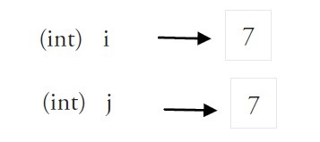

值类型，如：int、float、bool、string、array、struct

引用类型，如：ptr（指针）, slice、map、channel、func、interface

**值类型**：值类型变量存储在栈中。

```go
var i int = 7
var j = i
```

使用`=`将一个变量的值赋值给另一个变量时，实际上是在内存中将`i`的值进行了拷贝



**引用类型**：被引用的变量会存储在堆中，以便进行垃圾回收，且比栈拥有更大的内存空间。

更复杂的数据，例如`ptr`、`slice`、`map`、`channel`、`func`、`interface`通常会需要使用多个字，这些数据一般使用引用类型保存。

```go
package main

import "fmt"

func main() {
    var r1 int = 20
    var x, y *int = &r1, &r1
    fmt.Println(*x, *y)
}
```


一个引用类型的变量x 存储的是r1的值所在的**内存地址**，或者内存地址中第一个字所在的位置。一个引用类型的指针指向的多个字可以是在连续的内存地址中（内存布局是连续的），这也是计算效率最高的一种存储形式；也可以将这些字分散存放在内存中，每个字都指示了下一个字所在的内存地址。